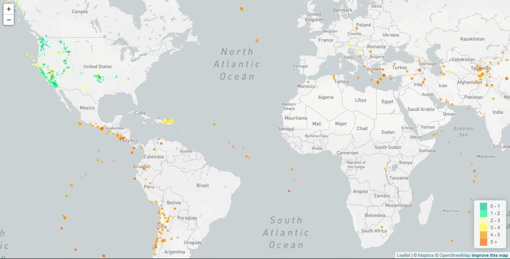
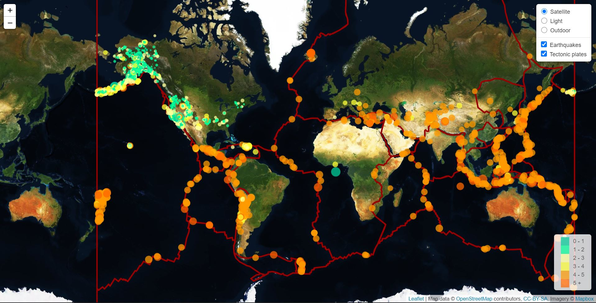

# Geological analysis
## Objective: 
Create maps to illustrate seismic activity and its relationship with tectonic plates using HTML, CSS, geojson, Leaflet, JavaScript and D3.js.

## Sources
The current data sets includes geojson data from an API on earthquake magnitudes [USGS GeoJSON](https://earthquake.usgs.gov/earthquakes/feed/v1.0/geojson.php) and tectonic plates from a github account  by coordinates [Tectonicplates](https://github.com/fraxen/tectonicplates).

## Data visualization

